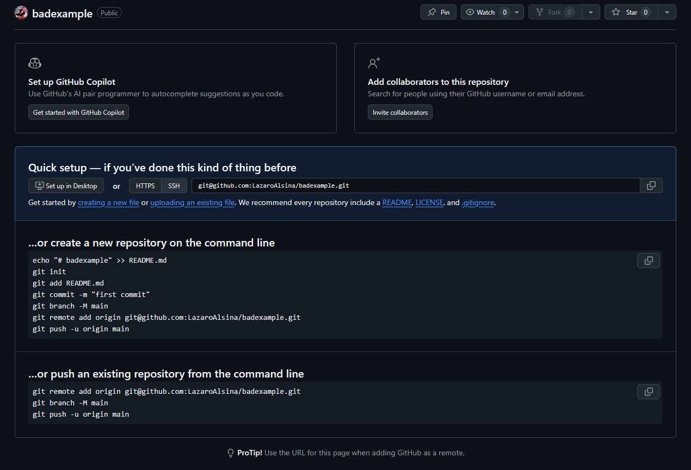
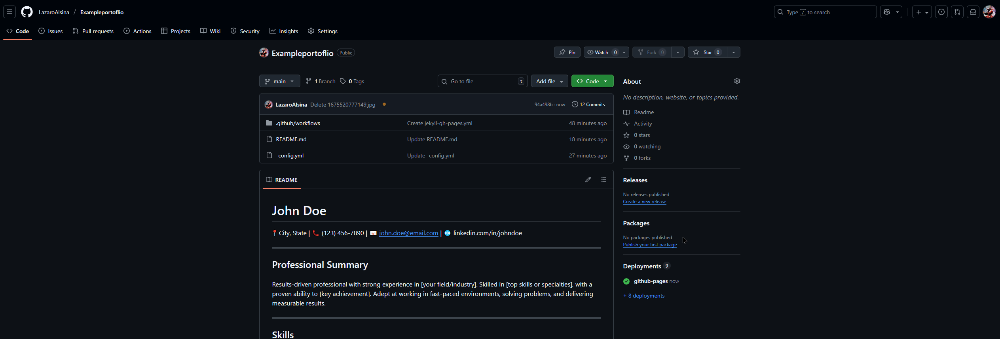

# How to make a Portfolio with GitHub Pages

Learning how to use GitHub's pages to build a basic website using their version of Markdown, and being able to show off your work.

## What is GitHub

GitHub is a website where you can host a repository of various items, such as code. Many programmers use these repositories to showcase their programming skills and other non-programming talents. Think of these repositories as projects being hosted on a website on which you can collaborate with people online with these projects.

There are options to have these repositories as private but still shareable on the internet. GitHub, in short, is a cloud-based solution to share projects fast with many collaborative tools, but you can do more than that, like hosting your own portfolio on their website.

## GitHub Pages

GitHub Pages allows you to make a free website to post your projects, as well as a portfolio to help you show off your work.  
GitHub Pages is a feature that allows you to easily showcase your projects to others, including advanced collaboration tools. However, in this guide, we are more focused on using it for hosting our **portfolio**. A Feature that GitHub wants users to use.

You have two options for building a website with pages.

1.  From scratch (You have to use Front-End tools like HTML, CSS, and JavaScript)
2.  Jekyll (Using markdown instead of Front-End tools like HTML.)


Once you pick an option, you can deploy or launch your GitHub pages. The one we are focusing on today is **Jekyll**, as it simplifies the process of creating a website quickly and provides a great starting point!

## Jekyll

This is a special feature in GitHub that enables us to host a site on GitHub Pages. This software is already available on GitHub, so no download is required; however, we need to configure it to work. To do that, we first need a repository!

## How to start a Repository and a website

### Sign up for GitHub

First, you have to sign up or log in to your GitHub account. Once you're done that, it's time to build a Repository.


### Making your Repository

Once you are logged in, add a new repository. Sometimes, you will be in the Overview section, which provides a dashboard of your activities or a home page with a dashboard. Depending on the page you are on, creating a new repository may be located at the top left or right, marked by a green button.

**Home Dashboard/Home**  


**GitHub Overview**  


#### Git Hubs Interface

The Repository should have a name that makes sense for what you are doing. If it's a project like a capstone, you should name it after your capstone. Alternatively, if you are creating a portfolio, you can call it 'Portfolio'. In this guide, we focus primarily on a portfolio, which is what you will see throughout.

Once a name is given, toggle the "Add README" from Off to On. This is very important as it's needed for us to get Jekyll to work. Then click on "Create repository".


Great job! Now it's time to configure your Repository, but first, let's learn how to navigate a repository.  
(If you see this screen, it's because you did not add a README.md, click on the hyperlink README to add it.)  
  
**How to fix this:**  


Once you click on the README, click on the green button on the top right that says "commit changes", and then click on "commit changes". Click on Code on the top left of your screen, and you should be good to go.

### Navigating your Repository and starting your website

When your Repository is made, it should automatically bring you to your code tab. This is where you should see your README.md file. This file is critical for what we are doing, and we should have a basic idea of how to operate GitHub; luckily, the hardest part of GitHub (~~Other than the coding~~) is navigating the website and all of its large features that it offers.


#### Code Tab

The Code tab is where we go to change our code. There is also something there called branches and tags; we don't have to worry about those, including the other code button in green. The only thing we need to play with is the pencil button next to the README that we made. **Click on it**.


That is our code; it should just have a # with whatever name you made. Change it a bit and then click on the green button on the top right that says Commit changes.


You can add more details if you like; this is best practice for those who code and work with others, but for our current purpose, these details are not as important. We can just click on the other green button that says "Commit changes.".

Now we have a bigger view of the changes we just did under the Preview tab. You can also switch between Code and Blame, another feature from GitHub for Collaborations that we don't need, but is good to know in case you get lost navigating here. We will be editing this README a lot for our Portfolio.


Take a good look above those tabs (Preview | Code | Blame), where you see the name of your repository and then a forward slash "/" followed by the name of the file we are working on, which is README.md. This is the URL to get to this section of your GitHub repository. Without getting into heavy detail, what exactly is a URL, and all the fancy things you can do with it. This URL is our pathway; we need to learn how to operate it for some advanced features for our website, like adding pictures, videos, and many other essential tools.


The terminology we use when managing these pathways is known as directories. If you use Microsoft or Apple products, you are probably already familiar with directories; they are commonly referred to as folders. They are, in general, the same and can be used interchangeably. Still, many guides out there that you may want to use for your own research may call them directories and mention root pathways, which is another fancy way of saying the main folder that holds all the data you need for a job.


A lot of times this main folder "Root" hold all the folders and is considered the parent of every folder relative to its use (of course, this is super simplified, as root has many meanings and essential uses, but for our purposes, the root here is your repository name that holds all of our folders and data(pictures for our portfolio)). A lot of times, you will see just one forward slash "/". This is known as the root.

**Example of a root directory of a Linux System:**

```
/ 	      -> Root 
├── bin       -> Essential user binaries (ls, cp, mv, etc.)
├── boot      -> Bootloader files (kernel, initrd, grub)
├── dev       -> Device files (disks, terminals, etc.)
├── etc       -> Configuration files
├── home      -> User home directories
├── lib       -> Essential shared libraries
├── media     -> Mount point for removable media (USB, CD-ROM)
├── mnt       -> Temporary mount point
├── opt       -> Optional add-on application software
├── proc      -> Virtual filesystem for process info
├── root      -> Root user’s home directory
├── run       -> Runtime variable data (PID files, sockets)
├── sbin      -> System binaries (init, shutdown, fdisk, etc.)
├── srv       -> Data for services (e.g., web, FTP)
├── sys       -> Virtual filesystem for system/kernel info
├── tmp       -> Temporary files
├── usr       -> User programs, libraries, docs
│   ├── bin   -> Non-essential user binaries
│   ├── lib   -> Non-essential libraries
│   ├── local -> Locally installed software
│   └── share -> Shared data
└── var       -> Variable data (logs, cache, spool, etc.)

```

Let's click on the "Code" tab again, and now we are back to the main page of the repository. Once again, we are back to the main section of our repository. Now that we have an idea of how to navigate the Code section, let's move on to a more challenging section—the Settings Tab.


#### Settings Tab

On the last side of your tabs, where you first click on "Code" to your right, you should see a settings tab. This setting differs from the profile setting at the top right of your GitHub. This Setting applies only to your repository, and we need to go inside this to start and configure our Jekyll, finally. **Click on it**.


Don't be shocked by the massive amount of information here; we only need to navigate to one section in this setting. **Pages**, which is on the left side of the navigation bar. **Click on it**.


Now, locate the GitHub Pages section where it says "Build and deployment". There should be a drop-down menu that allows you to select "GitHub Actions". Once you do this, you should see GitHub Pages Jekyll right underneath it. **Click on** Configure that is related to Jekyll.


##### YML

This is a configuration file, which uses YML, a language used to organize and configure programs. We don't need to learn this; other than that, we need to click on the green button that says "Commit Changes" and then click on the green button again.


Notice our pathway, it goes all the way to workflows, click on the root(the name of your repository).


We now have our Jekyll configured to run, but how do we see and edit our website? We need to now go to the "Action Tab".

#### Action Tab

**Click on** the Action Tab, which is two tabs to the right of **Code**. There is a lot of cool information here, but the page that is needed here is "Deployments," which is on the left side under "Management". **Click on** Deployments.

  


You should be able to see a link to your portfolio; the first hyperlink should take you there. Bookmark it or keep it safe on a separate page, as you will need to switch and refresh each time a change is made. (These changes can take time)


Now that we have the basic website up and running using GitHub Pages, we will focus on configuring our Jekyll using some code in YAML(YML) to customize it. This is where we will add our theme and some important information.

## Configuring Jekyll and selecting your Theme

This is the most challenging part of the guide: reading documents about Jekyll and selecting a theme. Let's go to that page now.

### Jekyll's Docs

This page, [GitHub Docs Jekyll](https://docs.github.com/en/pages/setting-up-a-github-pages-site-with-jekyll/adding-a-theme-to-your-github-pages-site-using-jekyll "A link about GitHub's Jekyll") . has all the documentation we need to get started on our little project. Still, the information you see here can be overwhelming, so we will focus only on what is essential.

Scroll down a bit and look at the supported themes. We will be selecting one of these themes. I personally prefer the "minimal" theme, so you will see it used in this guide. Once you have found a theme you want, remember how its spelled. If you wish to view these themes before using them, click on the hyperlink associated with the name that fascinates you, such as **Architect**. Right under **"About"**, located on the right side of the green button that is labeled "Code", you should see a hyperlink labeled "https://pages-themes.github.io/architect/". Once you click on it, you can see how it looks, along with a guide on how to use Markdown.


You can follow the guide on Jekyll and end your guide here if you prefer, but if you struggle to follow their instructions, you can continue with this guide.

### Adding a file to your Repository

For us to build our portfolio, we need to learn how to add files to our repository. The first file we need to add will allow us to configure Jekyll again, but it is related to Markdown, a language we will dive into later in this guide.

#### \_Config.yml

We need to create a file called '\_config.yml' and we must spell it just like that with the underscore.

Go back to your "Code Tab" and click on "Add File", which is next to "Code", the green button. Then click on "Create new file".


Here, you want to name the file "\_config.yml" and copy and paste this code into it. (The Code is case sensitive.)

```
title: Your name
logo: /assets/
description: Text below the image
show_downloads: false
theme: jekyll-theme-Minimal
```

  
(Important note: Not all themes have a logo; check your sample and see if it has a logo.)

This code here allows us to make a title, in which you can change it to your name, add a picture, which could be a beautiful picture of you, with a bit of description on it, with your theme that you selected! There is also the Show Downloads option, which allows people to download your resume; however, this guide is quite lengthy, so that we won't explore that route.

Commit the change and return to the "Action Tab". If you're fast enough, you should see a yellow circle indicating that your website is being deployed. Every time we make a save, change, add a file, or even remove one, we will see this happening, and the website will change accordingly. Once it's green, open up your website and see the change!


Now that we have configured and set up our website, it's time to learn how to add content to our site. In other words, how are we using **Markdown** to build our Portfolio?

## Markdown

Markdown is a markup language; in short, it just means we use special syntax to give special headers, highlights, and some other cool changes to fonts in which we write. A common markup language used that a lot of users are not aware of is Microsoft's Word Office editor. Sure, not the whole thing is a markup, but it does use it when you want to **bold** something. You can even click a special button, depending on the edition of Microsoft Word, that allows you to see the syntax for their markup.

As a matter of fact, this whole guide is using nothing but Markdown, and its standards have improved a lot as this guide is written using the Markdown from Joplin, and all I am doing is copying and pasting the code to GitHub so you can read it! There are some downsides to using this method, like some minor changes in syntax, as the Markdown in GitHub is a bit different, but it's not that hard to use!

Here are the basics of using Markdown.

Pound signs (what people call hashtags nowadays, "#" nowadays) are used to make headers. The more # you place, the smaller the text will seem. These are great for organizing your writing.

Another common one would be \**Bold*\* with the wild character. Some people call it the star. This one has to be encapsulated where the beginning has two \*\*, then you add the text you want, then it ends with the \*\*. If you fail to add an ending to the **Bold**, the language has no idea where it stops, so it may make everything bold until you give it a stopping point.

The best way to learn how to use Markdown is by playing with it. Take a look at [this](https://pages-themes.github.io/slate/ "Slate Markdown Guide"), it gives a cheat sheet on how to use Markdown. Follow it and see how it goes, but of course, where can you test this?

Let's test this on our portfolio website!

### Editing your README.md

Make sure you are back to your repository on GitHub under the Code section, and notice your README.md ends with a **.md**. That "." with whatever letter text at the end, tells us what file it is. In this case, it's Markdown (md). and this is the same for yml. It's essential for us to notice these small details, as we add more files and data, it will become increasingly difficult to navigate.

Let's edit the README.md by selecting the pencil and start adding some Markdown.

Here is an example of what I did, which you can copy paste and play around with to better understand markdown.

```
# John Doe
📍 City, State | 📞 (123) 456-7890 | 📧 john.doe@email.com | 🌐 linkedin.com/in/johndoe

---

## Professional Summary
Results-driven professional with strong experience in [your field/industry]. Skilled in [top skills or specialties], with a proven ability to [key achievement]. Adept at working in fast-paced environments, solving problems, and delivering measurable results.

---

## Skills
- Project Management  
- Communication & Collaboration  
- Data Analysis & Reporting  
- Customer Service & Client Relations  
- Microsoft Office Suite / Google Workspace  
- [Other relevant tools/software]

---

## Professional Experience

**Job Title**  
*Company Name – City, State*  
MM/YYYY – Present  
- Lead [responsibility/project] resulting in [measurable outcome].  
- Collaborated with cross-functional teams to [achievement].  
- Improved [process/system] by implementing [solution].  

**Job Title**  
*Company Name – City, State*  
MM/YYYY – MM/YYYY  
- Managed [specific responsibility].  
- Delivered [results] ahead of schedule.  
- Provided excellent service to [stakeholders/clients/customers].

---

## Education
**Degree / Diploma**  
*University / School – City, State*  
MM/YYYY – MM/YYYY  

---

## Certifications
- Certification Name – Issuing Organization (Year)  
- Certification Name – Issuing Organization (Year)  

---

## Additional Information
- Languages: [e.g., English, Spanish]  
- Volunteer Work: [Organization, Role]  
- Interests: [Optional – relevant to career goals]  
```


Yes, I did ask ChatGPT to give me a template as an example here. You could use this one or make your own; all of these are good options, but you should try to copy your resume to this README.md.

You can also edit and use the preview feature to see what changes are made, instead of waiting for your website to make the updates. (Your website is not going to perfectly reflect the preview, but it's a useful tool. )

### Editing your \_Config.yml again

Another thing that you may want to edit is your title on your website, and more importantly, add your picture!

#### Adding a picture

For us to add a picture, we need to upload that file (~~Just like on Facebook~~) so we can add it using Markdown!

In the "Code tab" of your repository, click on "Add file" and we will upload any picture you like! Select a professional photo of yourself, and let's see how it looks on the website!



Commit changes, and let's talk about the directory(folder) again, as it's relevant!

#### File management

If you upload a file and do not give it a pathway or a folder, you should see it on your main page. Notice the special folder we have, which is where our Jekyll works are located, called ".github/workflows". This is the pathway to get inside this folder. We have to know how pathways work in order to use Markdown to display the information we want. The information in our case is the photo. Locate the uploaded file, click on it until you see the image, and notice the copy sign next to the pathway(it looks like a URL). Copy it as we will need that.

  


There are different ways to display your image on your website.

**If you are using a theme that supports a logo, use the method below:**  
Then, in your files, click on "\_Config.yml", edit it, and paste that code after `logo:` , but make sure to remove "`/assets/`" first before you place it, or just replace it with the pathway. If everything was done right, a picture should have been uploaded to your website!

Example: my photo is called 1675520777149.jpg and its copied pathway is `1675520777149.jpg`.  
  


**If you are using a theme that does not support logos, you have to add your logo to your Markdown**

Go and edit your "README.md" and add your photo somewhere in your file. This is the syntax to use an img.  
``

Example:  
``

  


This can be very complex if it's your first time. If you get stuck here, please let me know, as the more you use it, the better you understand it. Also, not all themes have logos. You will have to add it in a different way.

By managing your folders, you can add more photos and even videos! There are limits to Markdown and what you are allowed to upload, but as long as you know how to upload the file, keep it neat and organized. You should be able just to copy that pathway and paste it where you want it.

## Show off your work

I hope this guide helps you out. You can also use this [Video](https://www.youtube.com/watch?v=D9CLhQdLp8w), where I got a lot of inspiration and helpful information about making a portfolio with GitHub Pages. His guide is not 100% to this one, but there is some stuff in the video that can help you. [Here](https://lazaroalsina.github.io/Portfolio2/) is a website made using this guide so you have a better idea what it should look like.

I hope this guide helped out, good luck out there!
